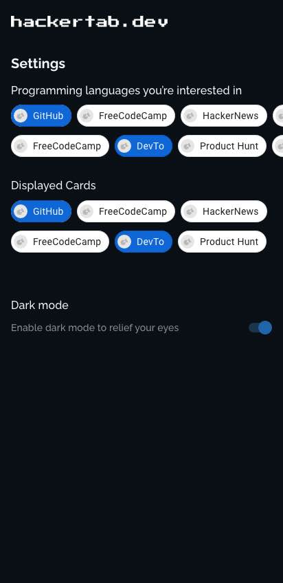

# hackertab-android
  
## 📝 About 
Hackertab brings the latest news, libraries, tech events, jobs... related to your profile (back-end, mobile, full stack, data scientist...) and visualize them in a proper way so you don't have to waste time jumping between different data sources.

This is the Android version of the extension brought to your phone now so you stay always posted even if you’re not on your pc.

## 🔨 Stack
- Clean architecture / MVVM
- Multimodule
- Dependency injection - Hilt
- Kotlin coroutines
- Jetpack compose
- Room Database

## 📱 Requirements
Android Studio 4.2 or newer.

## Authors
@Zouhir Rajdaoui (contact)  
[@Amine](https://twitter.com/aminekarimii)
