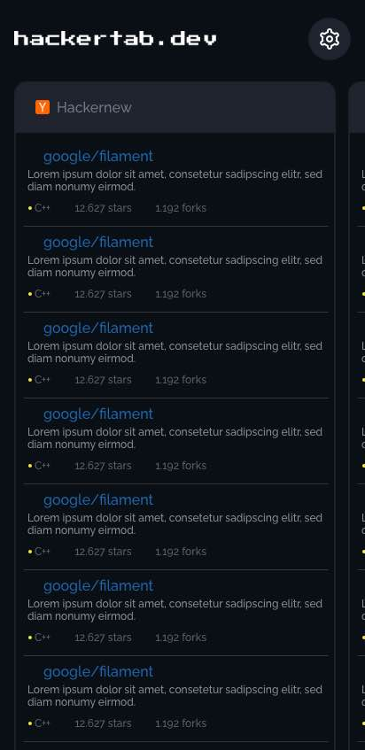
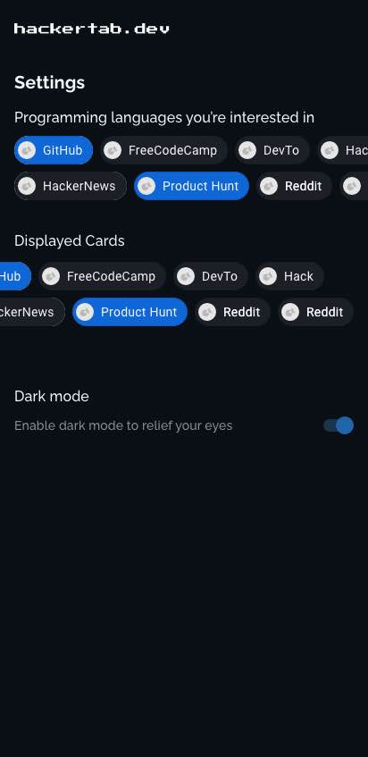

# hackertab-android

  
  

## 📝 About 
Hackertab brings the latest news, libraries, tech events, jobs... related to your profile (back-end, mobile, full stack, data scientist...) and visualize them in a proper way so you don't have to waste time jumping between different data sources.

This is the Android version of [hackertab.dev](https://hackertab.dev) extension brought to your phone now so you stay always posted even if you’re not on your pc.

## ⬇️ Download
Download from Playstore 👇🏼

## 🔨 Stack
- Kotlin
- Clean architecture / MVVM
- Multi-Module architecture
- Dependency injection - Hilt
- Kotlin coroutines
- Jetpack compose
- REST API with local caching using Room Database

## 🚧 Todo  
### Features
- [x] Start with 4 sources: Github, Reddit, FreeCodeCamp, and Hackernews
- [ ] Add a settings screen
- [ ] Bookmarks  
### Developement
- [ ] Test coverage

## 🧩 Requirements
Android Studio 4.2 or newer.

## 🔗 Authors
[@Zouhir](https://rajdaoui-zouhir.vercel.app)
[@Amine](https://twitter.com/aminekarimii)
