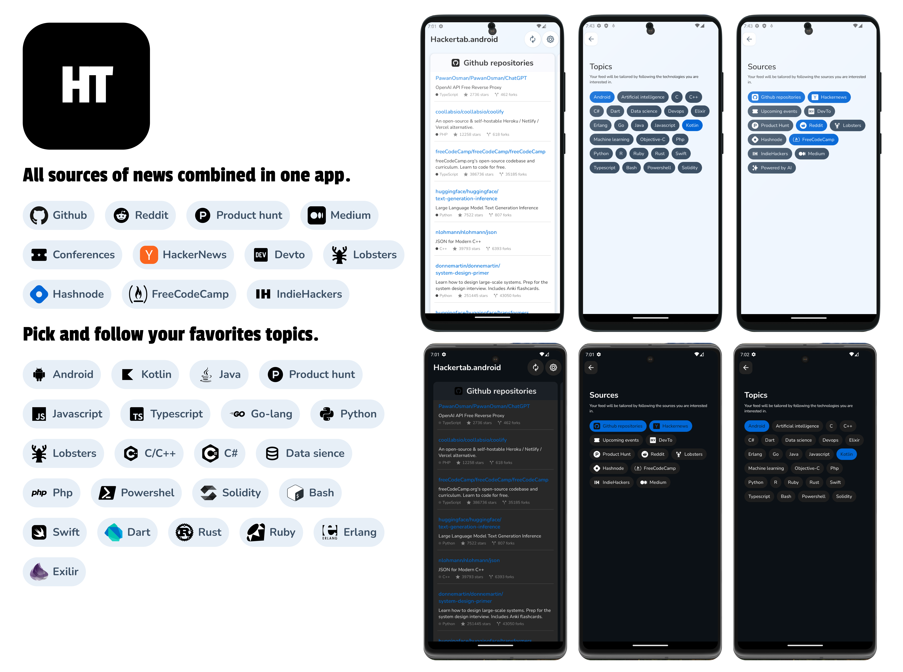

# hackertab-android
<table align="center">
<tr>
<td>
 
</td>
</tr>
</table>

## 📝 About 
Hackertab brings the latest news, libraries, tech events, jobs... related to your profile (back-end, mobile, full stack, data scientist...) and visualize them in a proper way so you don't have to waste time jumping between different data sources.

This is the Android version of [hackertab.dev](https://hackertab.dev) extension brought to your phone now so you stay always posted even if you’re not on your pc.

## ⬇️ Download
Very soon in Playstore 


## 🔨 Stack
- Kotlin
- Clean architecture / MVVM
- Multi-Module architecture
- Dependency injection - Hilt
- Kotlin coroutines
- Jetpack compose
- REST API with local caching using Room Database


## 🚧 Todo  
### Features
- [x] Start with 4 sources: Github, Reddit, FreeCodeCamp, and Hackernews
- [x] Add a settings screen

### Developement
- [ ] Test coverage

## 🧩 Requirements
Android Studio 4.2 or newer.

## ⬆️ Contributing
See [the contributing guide](CONTRIBUTING.md) for detailed instructions on how to get started with our project. 

## 🔗 Authors
[@Zouhir](https://rajdaoui-zouhir.vercel.app)
[@Amine](https://twitter.com/aminekarimii)

## License 🔖
```
    Apache 2.0 License


    Copyright 2022 RAJDAOUI Zouhir

    Licensed under the Apache License, Version 2.0 (the "License");
    you may not use this file except in compliance with the License.
    You may obtain a copy of the License at

       http://www.apache.org/licenses/LICENSE-2.0

    Unless required by applicable law or agreed to in writing, software
    distributed under the License is distributed on an "AS IS" BASIS,
    WITHOUT WARRANTIES OR CONDITIONS OF ANY KIND, either express or implied.
    See the License for the specific language governing permissions and
    limitations under the License.

```
